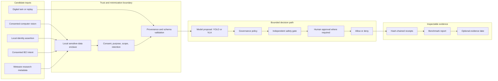

# BioPhysical Assurance Commons

An inspectable, offline benchmark for **whether a physical-AI action was authorized**, even when a model predicts that it will succeed. The primary v2 case is a synthetic robotic handover: a vision-language-action proposal remains confident after consent expires, and the governor denies the later action while emitting verifiable decision receipts.

This is an early **assurance prototype**, not a biometric identification product, medical device, aircraft recorder, certified safety controller, or deployed surveillance system. It runs entirely on synthetic metadata; it never processes faces, neural signals, biological tissue, or hardware commands. Its job is to establish reproducible contracts and evaluation methods before any real integration is considered.

## Architecture



The runnable slice implements strict v2 schema parsing, fresh and purpose-bound synthetic consent/identity/BCI/model/safety/human inputs, deterministic policy replay, and receipts whose decisions are recomputed during verification. The other boxes are **integration seams**, not working connectors. See the [data-flow architecture](docs/ARCHITECTURE.md), [production target](docs/DEPLOYMENT.md), and [threat model](docs/THREAT_MODEL.md).

## Run the baseline

Python 3.10+ and the standard library are enough:

```bash
PYTHONPATH=packages/assurance-core/src python -m biophysical_assurance.cli run packages/assurance-contracts/scenarios/expired-consent-handover.v2.json --out out/my-first-v2-run
PYTHONPATH=packages/assurance-core/src python -m biophysical_assurance.cli verify packages/assurance-contracts/scenarios/expired-consent-handover.v2.json out/my-first-v2-run
make check
```

The expected first decision is `allow`; the second is `deny` with `consent_inactive`. `report.json` has zero false allows and zero false denies against the scenario's expected decisions. `receipts.jsonl` contains a SHA-256 chain bound to the scenario, policy and action digests. Verification recomputes each policy decision. The chain detects local editing if the scenario and expected root are retained or anchored externally; it is **not** a digital signature and does not establish who ran the test. Output directories are staged and existing directories are rejected rather than silently overwritten.

For a local, shared-secret authentication check, add `--auth-key-file path/to/key --key-id name` to `run` and `--auth-key-file path/to/key` to `verify`. The key must contain at least 32 bytes and remain outside the repository. This is HMAC authentication between holders of the same secret, not non-repudiation. A deployment still needs managed keys and an independent evidence anchor.

Optional editable install: `python -m pip install -e packages/assurance-core`, then use `bpa run` and `bpa verify`. Earlier `bpa.scenario.v1` fixtures remain runnable for reproducibility; new work should target v2.

## Monorepo layout

| Path | Ownership |
|---|---|
| `packages/assurance-core/` | Installable Python evaluator, CLI and tests |
| `packages/assurance-contracts/` | Versioned JSON Schemas and synthetic scenario fixtures |
| `adapters/` | Candidate integration catalog and boundary rules |
| `docs/` | Architecture, benchmark, deployment, threat and product plans |

The core package depends on contract **versions**, not a hardcoded sibling path at runtime; tests use the local contract fixtures. A future adapter package must obey the same contracts and remain unable to issue actuator commands directly.

## Component boundaries and honest maturity

| Domain | Candidate input to the assurance layer | Evidence required before claims | Current state |
|---|---|---|---|
| Computer vision / YOLO | Object or event proposal with model/version/time | Per-class performance, shift tests, latency and provenance | Contract concept only |
| Biometric verification | Local, consented **1:1 assertion**; no raw template in receipts | FMR/FNMR at fixed thresholds, subgroup reporting, spoof tests | Synthetic Boolean only |
| BCI | Explicit command intent assertion and signal-quality metadata | Unintended-action rate, calibration drift, subject-level splits | Synthetic Boolean only |
| Wetware / organoid research | Dataset or experiment metadata with provenance | Viability, batch variance, chain of custody, reproducibility | Research metadata concept only |
| VLA / Isaac GR00T | Proposed bounded robot action and uncertainty | Task success, unsafe action rate, sim-to-real gap, energy | Synthetic confidence only |
| Digital twin | Versioned scenario and environment assumptions | Fidelity, coverage and reality-gap study | JSON scenario replay only |
| Governance | Consent, purpose, identity freshness, proposal freshness, safety, approval | False allows/denies, policy coverage, bypass tests | Runnable v2 synthetic baseline |
| Evidence recorder | Decision receipt and scenario/policy/action digests | Recomputed decision verification, retention and independent anchoring | Runnable local chain, optional HMAC |

These domains must not be collapsed into a single leaderboard score. A high model-accuracy score cannot offset an unauthorized physical action. See [docs/BENCHMARKS.md](docs/BENCHMARKS.md) for denominators, required gates, staged evolution, and failure criteria.

## Relationship to the existing project ecosystem

This repository is a neutral contract and benchmark layer. [adapters/README.md](adapters/README.md) maps candidate seams to GRC Claw, Robot Black Box, Physical AI Governor, CyborgBench, identity-fabric benchmarks, EvalLake, and other local work. A map is not a tested integration or endorsement of another project's certification claims.

The [integration contracts](docs/INTEGRATIONS.md) specify proposed normalized fields and adapter acceptance tests for YOLO, Isaac GR00T, BCI, wetware research metadata, proprietary and OSS digital twins, local biometric verification, Obsidian/Cognee/LangGraph context, GRC Claw, Robot Black Box, and EvalLake.

## Proposed delivery stages

1. **v0.1–v0.2 synthetic replay (implemented):** strict v2 contracts, deterministic cases, policy decisions, recomputed receipts, staged evidence output, optional local HMAC and regression tests.
2. **v0.3 benchmark fixtures:** versioned perturbations, dataset cards, subgroup-safe aggregate metrics, machine-readable benchmark manifest, and negative-control cases.
3. **v0.4 optional simulation adapters:** isolated ROS/LeRobot/Isaac replay that returns proposals only; governance remains an independent gate.
4. **v0.5 restricted lab pilots:** consented identity/BCI assertions through local enclaves, hardware interlocks, human supervision, incident response, and independently reviewed data protection.
5. **Commercial deployments:** enterprise tenancy, connectors, key custody, auditable retention, support/SLA, and independent assurance. Each deployment must validate its own hazard model; OSS benchmark results do not certify it.

Public code should include schemas, synthetic fixtures, reference evaluators, and reproducible reports. Customer data, biometric templates, private credentials, threat intelligence, deployment topology, and commercial operational controls belong in separately governed private environments. This is a product boundary, not security by obscurity.

The delivery and commercial boundaries, including evaluation gates and an explicit unit-economics model, are in [docs/PRODUCT.md](docs/PRODUCT.md).

## Reference material

- [NIST AI Risk Management Framework](https://airc.nist.gov/airmf-resources/airmf/5-sec-core/)
- [NIST Face Recognition Technology Evaluation](https://pages.nist.gov/frvt/html/frvt1N.html)
- [Neurodata Without Borders](https://nwb.org/) and [BIDS specification](https://bids-specification.readthedocs.io/)
- [NVIDIA Isaac GR00T](https://github.com/NVIDIA/Isaac-GR00T)

No performance or regulatory claim is inherited from these references. Model hardware needs depend on version and workload; the benchmark does not impose an RTX 4090 minimum.
