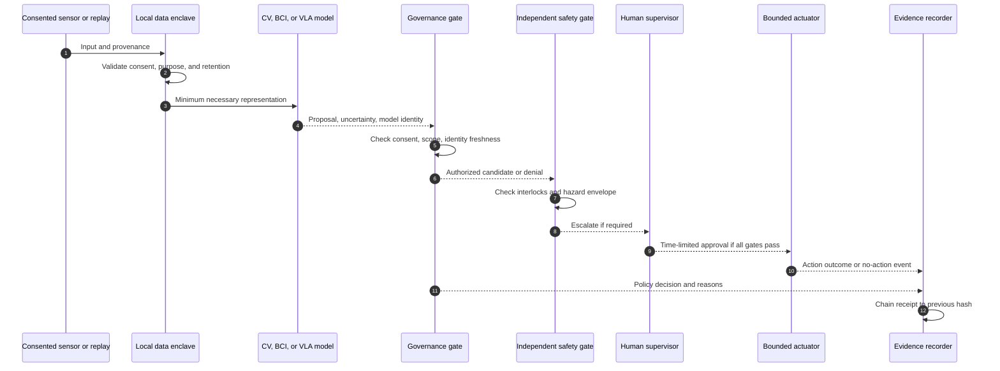
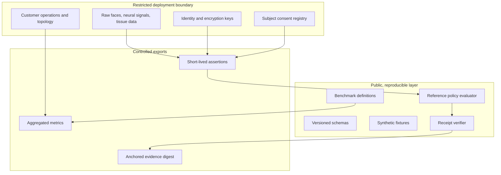
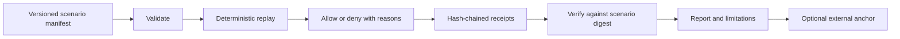

# Architecture and trust boundaries

The only implemented runtime is offline synthetic replay. The expanded architecture is a roadmap with explicit boundaries so a future device adapter cannot silently turn a model proposal into an actuator command.

**No direct actuation:** the model produces a proposal. A separately controlled safety gate and a bounded actuator gateway are required for lab work. If an input is missing, stale, unverifiable, or outside purpose/scope, deny and record the reason. The current CLI does not control actuators.

The public layer can receive a pseudonymous subject reference and a short-lived Boolean verification assertion. It must not receive raw biometric or neural data. A production assertion needs provenance, issuer authentication, replay protection, purpose binding, and an expiry. This prototype models only the last three concepts at a coarse level and is not a production IAM system.

## Evidence lifecycle

`sha256` in a receipt is computed from canonical JSON of all other receipt fields. `previous_sha256` links the prior receipt. The verifier recomputes the chain and checks it against the scenario supplied by the caller. Without an independently retained root or signed external anchor, an attacker who can replace every file can rewrite both evidence and report. No trust claim should go beyond that boundary.

## Interoperability choices

- **Clinical and neural data:** prefer BIDS or NWB metadata at the boundary; subject-level consent and governance are deployment obligations. No clinical decision support is planned for the public prototype.
- **Vision:** evaluate model outputs under shift and low-light/occlusion; retain imagery only under explicit data controls.
- **Biometrics:** default to local 1:1 verification assertions. A 1:N watchlist is a distinct, higher-risk evaluation with its own lawful basis and error metrics; it is not implemented here.
- **Digital twins:** record asset versions, sensor assumptions, simulated perturbations, and measured sim-to-real gaps. Simulation success is not field safety.
- **Evidence lake:** only sanitized receipts or approved aggregates enter a shared Iceberg/EvalLake table. Restricted raw data stays in the controlled enclave.
