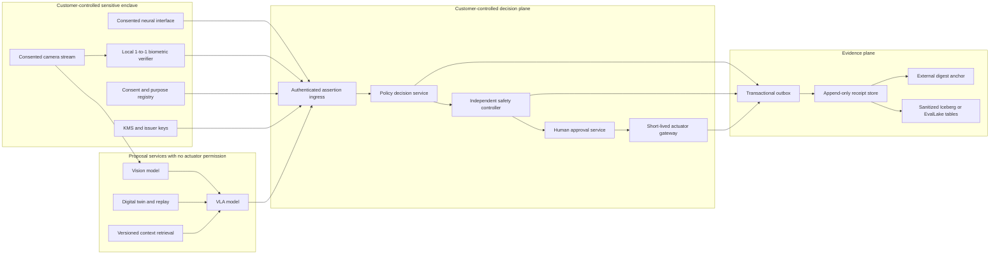
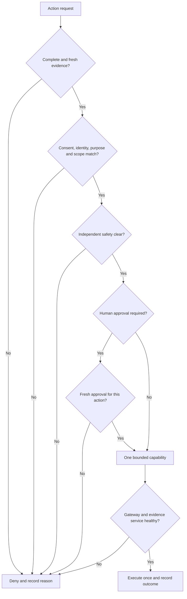

# Production target architecture and release gates

The shipped CLI is an offline synthetic reference implementation. This document defines the target deployment boundary and the work required before a supervised laboratory pilot. It deliberately separates a model's proposed action, a governance decision, a safety decision, and actuator authority.

**Authority rule:** only the actuator gateway can send hardware commands. It requires a fresh policy allow, safety clear, and any required human approval for one bounded action. Model services and RAG tools have no gateway credentials. The independent safety controller must be able to stop or refuse action even when the policy service allows it. If the decision plane or evidence outbox is unavailable, the gateway denies new actions and records the outage when service returns; physical emergency-stop behavior remains independent of software availability.

## Data and interface contracts

| Boundary | Input | Authentication / freshness | Output | Failure default |
|---|---|---|---|---|
| Sensitive enclave to ingress | Pseudonymous local assertion, purpose, scope, issuer, expiry | mTLS or signed assertion, issuer allowlist, nonce, clock-skew budget | Validated assertion metadata | Reject |
| Model to ingress | Proposal ID, model artifact digest, timestamp, uncertainty, bounded action | Workload identity and schema allowlist | Proposal metadata | Reject |
| Ingress to policy | Complete request context | Internal authenticated channel, idempotency key | Allow/deny and reasons | Deny |
| Policy to safety | Single-action authorization, short TTL | Audience binding and replay protection | Safety decision | Deny |
| Safety and human to gateway | Bounded capability for action, device and time | Separate principals, no shared super-admin path | One actuation or no action | No action |
| Services to evidence | Decision/event plus correlation ID | Transactional outbox; ordered, idempotent delivery | Append-only receipt | Stop new actions if receipt durability is required by hazard analysis |
| Evidence to analytics | Approved fields only | Data classification, redaction, retention policy | Aggregated metrics | Quarantine |

The v2 fixture models expiry, subject, purpose, scope and evidence freshness but **does not implement** issuer signatures, mTLS, nonce stores, device interlocks, an outbox, or a real clock. The local optional HMAC authenticates a completed bundle between parties sharing one key; it is not a digital signature or non-repudiation mechanism.

## Failure modes that must be exercised

Test stale assertions, future timestamps, revocation races, forged issuers, duplicate request IDs, out-of-order events, clock drift, policy rollback, model swap, interrupted writes, network partition, evidence-store outage, approval replay, cross-tenant reference collision, and emergency stop. The current v2 tests cover only the synthetic policy and local evidence subset; they are not a substitute for the integration and hazard tests above.

## Module map

| Module | Responsibility | Allowed dependency direction |
|---|---|---|
| `packages/assurance-core/src/biophysical_assurance/models.py` | Immutable domain types | No runtime side effects |
| `validation.py` | Strict v2 structure and semantic checks | Depends on models |
| `policy.py` | Pure allow/deny function | Depends on models only |
| `evidence.py` | Canonical hash chain, policy recomputation, optional HMAC | Depends on policy and validation |
| `runner.py` | Replay and benchmark accounting | Depends on policy/evidence |
| `storage.py` | Bounded local evidence I/O and staged publication | No policy decisions |
| `parsing.py` | Bounded strict JSON loading | No policy decisions |
| `cli.py` | Operator entry point | Calls core and storage |
| `legacy.py` | v1 compatibility only | Must not gain new deployment features |

In a service implementation, define separate ports for assertion verification, policy storage, safety controller, approval service, receipt sink, external anchor and clock. Keep the pure policy evaluator independent of transport and databases; deploy the gateway as a distinct principal and process. Do not merge the governor and safety controller into a single administrative path.

## Release gates for a supervised pilot

1. Threat model and data-flow inventory approved by the deployment owner; consent, lawful basis, retention, deletion and incident response specified for each data class.
2. Issuer-authenticated, short-lived assertions with replay protection; key rotation and recovery tested.
3. Site-specific hazard analysis and independent hardware interlocks; emergency stop and degraded-mode behavior demonstrated.
4. Contract and integration tests for every adapter; pinned model and policy artifacts; documented clock assumptions.
5. Benchmarks pre-registered with denominators, uncertainty intervals, cohort protections and explicit blocking thresholds.
6. Durable, access-controlled evidence storage with external anchor, backup/restore and tamper-response drills.
7. Supervised trial with rollback, on-call ownership, incident capture and independent review.

Passing these gates is a prerequisite for a pilot plan, not a general product certification. Applicable regulatory obligations depend on geography, data type and intended use.
