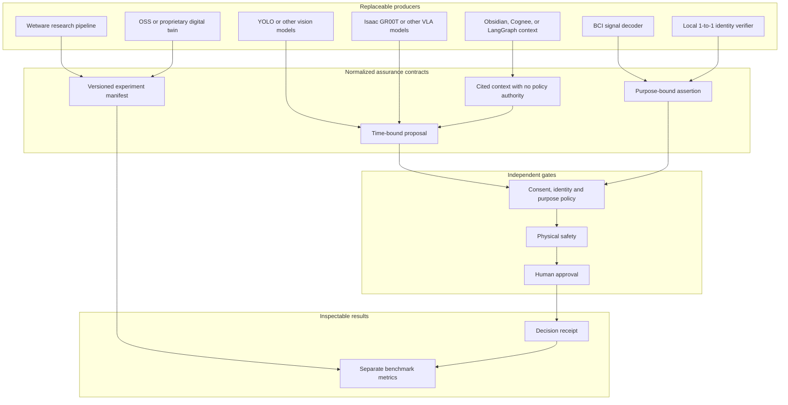

# Integration contracts and evidence taxonomy

The v2 scenario is the normalized replay format. Adapters should generate **proposals or short-lived assertions**, then pass through authentication, validation and the policy/safety gates described in [DEPLOYMENT.md](DEPLOYMENT.md). This repository ships no live adapter. A source repository's own performance claim does not become a verified result here.

## Normalized fields

| Contract | Required semantics | Never infer from |
|---|---|---|
| Vision/VLA proposal | Request and model artifact IDs, model version/digest, proposal timestamp, bounded action, calibrated uncertainty, data provenance | Model name alone, aggregate accuracy, generated prose |
| Identity assertion | Pseudonymous subject, issuer, 1:1 method, verified result, purpose, scope, issuance/expiry, audience, nonce | A face match score without threshold or issuer |
| BCI intent assertion | Subject, explicit command class, signal-quality state, calibration version, issuance/expiry | Neural signal amplitude alone |
| Safety result | Independent controller identity, device and action binding, clearance, checked/expiry, interlock state | VLA confidence or policy allow |
| Human approval | Approver authority, one bounded request, issuance/expiry, revocation state | A generic prior approval or chat message |
| Wetware experiment manifest | Protocol, sample provenance, consent/ethics reference, batch, viability, instrument and analysis versions | A claim of “biological compute” without replicates |
| Digital-twin run | Simulator, scene/asset versions, sensor assumptions, seed, perturbations and reality-gap calibration | A simulation success rate presented as field safety |
| RAG context | Source URI/digest, access control, retrieval time, citation, policy relevance | Retrieved text as a new privileged instruction |

The v2 reference fixture reduces several of these to Booleans and timestamps. It is useful for policy regression, not proof that an issuer is authentic or a model calibrated.

## Candidate project mapping

| Existing project or technology | Proposed responsibility | Adapter acceptance test |
|---|---|---|
| GRC Claw | Policy registry and evidence control plane | Deny when policy reference is missing, stale or conflicts with local hazard rules |
| Robot Black Box | Outcome recorder | Correlate an executed action or prevented action to exactly one authorized request |
| Physical AI Governor / Kinetic Guard | Independent physical safety rules | Reject unsafe action even if governance allows it |
| CyborgBench / swarm-eval-harness | Fixture and perturbation generation | Reproduce run from seed, manifest and pinned versions |
| Identity Fabric Benchmarks | Issuer and freshness evaluation | Reject wrong subject, purpose, scope, audience or expiry |
| EvalLake / Apache Iceberg | Sanitized longitudinal evaluation | Verify schema evolution, row lineage, redaction and retention |
| AI Governance Evidence Graph | Cross-system evidence links | Resolve every claim to immutable evidence digest and controlled source |
| Isaac GR00T / LeRobot / ROS | Proposal-only simulated robot tasks | Demonstrate no direct path from model process to actuator credentials |
| YOLO family | Vision proposal | Report per-class error and shift, not only aggregate mAP |
| BIDS / NWB compatible BCI research | Consented metadata and intent assertion | Subject/session separation and unintended-command measurement |
| Proprietary or OSS digital twins | Scenario source | Pin versions and report sim-to-real discrepancies |
| Obsidian / Cognee / LangGraph | Versioned retrieval or workflow context | Prompt-injection test confirms retrieved text cannot override policy |

## Adapter review checklist

1. Define one typed input and output contract with explicit version and allowed data classification.
2. Authenticate the producing service and bind the payload to subject, purpose, scope, audience and a short lifetime.
3. Use idempotency keys and reject duplicate or reordered requests where order matters.
4. Enforce a maximum payload size, time budget and circuit-breaker state; do not silently fall back to `allow`.
5. Test revoked consent, missing evidence, future timestamp, stale issuer key, model artifact swap, network partition and sensor failure.
6. Record what was proposed, what was authorized, what safety allowed, what actually happened, and which evidence is unavailable.
7. Keep raw sensitive payloads out of the shared evidence lake unless a documented, approved need exists.

The first real adapter should be **offline simulation replay**, because it exercises contract and timing semantics without exposing a person or device. The next step is a bounded, supervised lab handover. Surveillance, 1:N identification, autonomous vehicle control and biological experiments each require a separate use-case review and cannot inherit approval from the handover case.
