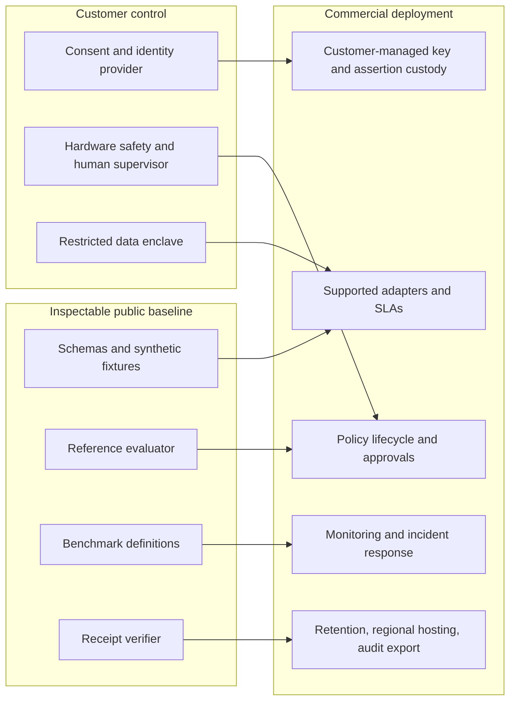

# Delivery system and commercial boundary

The public benchmark is the adoption engine: a peer reviewer can inspect schemas, run a deterministic failure case, change a scenario, and verify the receipt chain without a GPU or access to sensitive data. The commercial product is the deployment, integration, assurance, and operations layer around that baseline. Neither layer should claim aircraft-recorder equivalence or general safety certification.

## Open and commercial allocation

| Public repository | Commercial product | Customer-held or restricted |
|---|---|---|
| Contracts, fixtures, reference policy, verifier, test harness | Certified connector maintenance, tenant isolation, policy workflow, audit package generation, support and incident response | Raw biometric/neural/biological data, identity templates, encryption keys, proprietary model weights, site topology |
| Aggregate benchmark methodology and reproducible synthetic results | Site-specific hazard analysis, validation campaign, drift monitoring and SLAs | Consent registry, legal basis, incident records, retention decisions |

The commercial moat should be measurable execution quality: connector reliability, evidence completeness, deployment time, independent assessments, and renewal outcomes. Keeping public benchmark semantics stable prevents private lock-in from weakening credibility.

## One demonstrable case, four audiences

**Case:** a simulated robot hand is asked to hand over an object. Vision/VLA confidence remains high, but consent expires between two attempts. The first request is authorized; the second is denied with an explicit reason. The receipt chain preserves both decisions.

- **Nontechnical buyer:** two-panel animation showing the same successful-looking motion proposal and different authorization states. The point is that technical ability does not equal permission.
- **Technical reviewer:** replay the JSON fixture, inspect policy predicates, modify the expiry timestamp, verify deterministic output and tamper detection.
- **Risk reviewer:** inspect scope, approval, safety and evidence gates; ask for a hazard analysis before any device pilot.
- **Investor:** see an adoption funnel from public replay to paid integration and continuous evidence operations, with costs and conversion assumptions stated rather than implied by a viral demo.

A Remotion or HyperFrames video can render the two decisions, receipt hashes and control-state transition. Treat it as an explanation of the replay, not footage of a validated physical system.

## Stage gates

| Stage | Output | Required proof before next stage | Main cost driver |
|---|---|---|---|
| Synthetic baseline | Public contracts, replay, regression tests | Reproducible run and documented limitations | Maintainer time |
| Simulation | Seeded scenario families, model adapters, digital-twin versions | Scenario coverage and failure injection | GPU hours, simulation engineering |
| Restricted lab | Interlocked robot, consented assertions, supervised trials | Pre-registered hazard tests, incident procedure, data review | Hardware, safety engineering, trial operations |
| Customer pilot | One site and one bounded workflow | Measured false allows/denies, uptime, retention and audit export | Integration and support |
| Multi-site product | Versioned connectors and operational controls | Independent assessment and stable renewal economics | Support, compliance, reliability |

No NVIDIA GPU is needed for the public synthetic baseline. GR00T inference, fine-tuning and simulation have different requirements; quote exact model-version documentation and benchmark the target workload before budgeting hardware.

## Unit-economics model to fill with pilot data

Let `P` be annual platform price per customer, `I` one-time integration revenue, `C` annual direct cloud/compute cost, `S` annual support and assurance cost, `H` one-time deployment labor cost, and `L` expected customer life in years. Then:

- Year-one gross contribution = `P + I - C - S - H`.
- Recurring gross margin = `(P - C - S) / P` when `P > 0`.
- Lifetime gross contribution before acquisition cost = `L × (P - C - S) + I - H`.
- Payback months = `12 × acquisition_cost / (P - C - S)` when recurring contribution is positive.
- Per-evaluated-action cost = `(annual fixed assurance cost + annual variable processing cost) / annual evaluated actions`; show action volume and storage retention separately.

These are accounting definitions, **not estimates**. A credible investor model needs observed adapter effort, benchmark cost per scenario, GPU utilization, evidence storage per action, support hours, sales cycle, conversion, retention, and the share of pilots that fail assurance gates. Report deployment costs by domain: synthetic robotics, consented BCI, biometrics, and wetware research cannot be priced from one blended average.

## Evidence required for an investor diligence room

Maintain a versioned architecture, data-flow inventory, licenses and model provenance, consent and retention design, threat model, safety/hazard analysis, benchmark protocols, raw trial counts and denominators, independent test results, incident history, customer rights, and unit-economics source data. A successful synthetic replay is evidence of the reference evaluator only; it does not prove product-market fit, legal compliance, or physical safety.
